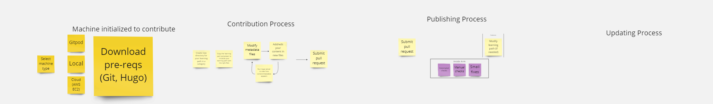

# Arm Learning Paths (prototype project)

GitHub source for the Arm Learning Paths static website, serving learning-based technical content for Arm software developers. 
This README contains two things:
1. 'How To Contribute' step-by-step guide
2. Documentation on the website's architecture

 

# How To Contribute

All contributions are welcome from individuals passionate about developing technology on Arm. As a summary, you can follow the Fork then Pull Request formula for contributing just like you would any Github project. The step-by-step details for how to contribute a Learning Path are contained in a Learning Path. [Read this Learning Path](http://www.armswdev.tk/learning-paths/cross-platform/_example-learning-path/) to start contributing and understand the process.

This picture provides a quality overview of the four flows involved in contributing Learning Paths:

If you have questions about this process please reach out to Arm-Tool-Solutions@arm.com

 
 

# Website documentation

This site is built on the [Hugo](https://gohugo.io/) web framework, ideal for generating static websites. Below is a brief description of the key files/directories of this website:

/
  * /content
    * where all learning path content is located.
  * /themes
    * where the html elements are defined that renders /content files into stylized HTML.
  * /tools
    * python scripts that automatically check for website integrety.
  * LICENSE files
    * where the license information is contained.
  * config.toml
    * where the high-level website configuration settings are defined.
 
