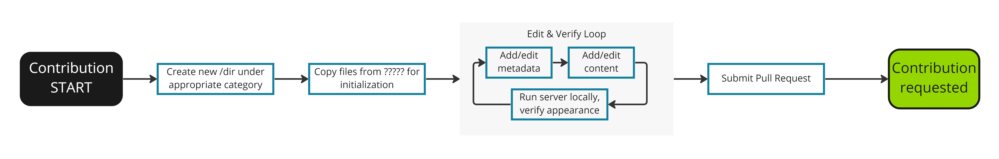

---
# User change
title: "Contribute: Writing style"

weight: 7 # 1 is first, 2 is second, etc.

# Do not modify these elements
layout: "learningpathall"
---

## Avoid first person
Active voice is preferred. Tell readers what to do.
* Great:&nbsp;	 	                        Implement this process to…
* OK:&nbsp;&nbsp;&nbsp;&nbsp;&nbsp;&nbsp;  	You can implement this process to…
* OK:&nbsp;&nbsp;&nbsp;&nbsp;&nbsp;&nbsp;   We can implement this process to…
* Bad:&nbsp;&nbsp;&nbsp;&nbsp;&nbsp;      	I implemented this process to…

## Give only required details
Use short, crisp sentences. Avoid storytelling and excessive background. 
* Bad:&nbsp;&nbsp;&nbsp; Due to the fact that we leveraged the CMSIS software library, issues with starting from scratch were avoided, and where you totally lacked the ability to implement optimized software before, you can now do so easily.
* Good:&nbsp; The CMSIS library enables out-of-the-box software optimization.

## Be specific
Use numbers and provide examples as much as possible. Avoid general statements and try to be as specific as possible.
* Instead of "almost always works" use "works on Linux and Windows 10"
* Instead of "significantly better performance" use "30% performance improvement"
